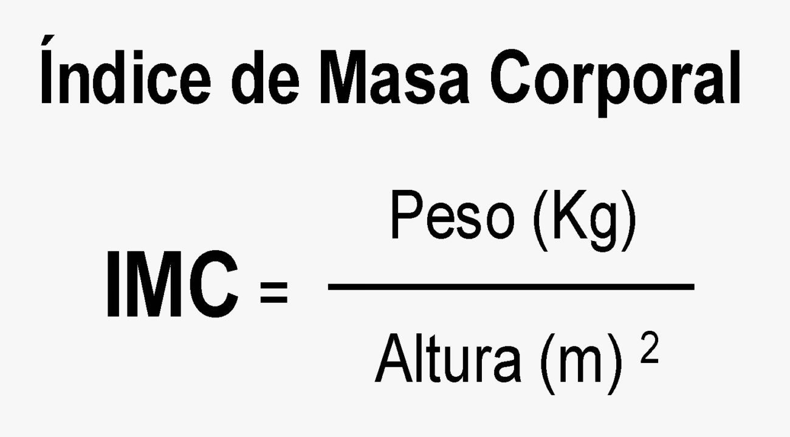

# IMC

É um cálculo para determinar o índice de massa corporal, que indica quanto a pessoa está de acordo com o peso e a altura. É importante entender que isso não indica se a pessoa está saudável ou não, mas é um idicativo de quanto está a proporção.

Lembando que pessoas que fazer atividade física o IMC pode está em uma faixa de sobre peso ou obesidade I, mas a porcentagem de gordura está baixa, isso porque músculo é mais pesado que o tecido adiposo.

## Deploy da aplicação

[IMC](https://rtacps.github.io/imc/)

## Cálculo de IMC

Para calcular o índice de massa corporal é peciso fazer a divisão do peso (massa emquilogramas) pelo quadrado da altura em metros.
Ficando desta forma:




## Código

1. Listener do Formulário: O listener é adicionado ao formulário para interceptar o evento de submit e evitar o comportamento padrão do formulário.

```js
document.getElementById('imcForm').addEventListener('submit', function(e) {
    e.preventDefault();
}
```

2. Obtenção dos Valores: Os valores de peso e altura são obtidos e convertidos para números. A altura é convertida de centímetros para metros.

```js
const weightDiv = document.getElementById("weight");
const heightDiv = document.getElementById("height");

let weight = parseFloat(weightDiv.value);
let height = parseFloat(heightDiv.value) / 100;
```

3. Validação dos Valores: Se os valores de peso ou altura não forem válidos, uma mensagem de erro é exibida e a função é encerrada.

```js
if (isNaN(weight) || isNaN(height) || height === 0) {
  const resultDiv = document.getElementById("result");
  resultDiv.innerText = "Por favor, insira valores válidos.";
  resultDiv.style.color = "#000000";
  return;
}
```

4. Cálculo do IMC: A função calculateIMC é chamada para calcular o IMC com base no peso e na altura fornecidos. A função calculateIMC calcula o IMC e o retorna com duas casas decimais

```js
function calculateIMC(weight, height) {
  return (weight / (height * height)).toFixed(2);
}

let imc = calculateIMC(weight, height);
```

5. Classificação do IMC: A classificação do IMC é determinada e a mensagem, cor e imagens correspondentes são definidas.

```js
let message = `Seu IMC é ${imc.replace(".", ",")}. `;
let color = "";
let imageHeader = "../../assets/faixas-imc.png";
let imageFooter = "";

if (imc < 17) {
  imageHeader = "../../assets/faixas-imc1.png";
  message += "Você está muito abaixo do peso.";
  color = "#6DB5E8";
  imageFooter = "../../assets/imc1.png";
} else if (imc >= 17 && imc <= 18.49) {
  imageHeader = "../../assets/faixas-imc1.png";
  message += "Você está abaixo do peso.";
  color = "#6DB5E8";
  imageFooter = "../../assets/imc2.png";
} else if (imc >= 18.5 && imc <= 24.99) {
  imageHeader = "../../assets/faixas-imc2.png";
  message += "Você está com o peso normal.";
  color = "#7EC395";
  imageFooter = "../../assets/imc3.png";
} else if (imc >= 25 && imc <= 29.99) {
  imageHeader = "../../assets/faixas-imc3.png";
  message += "Você está com sobrepeso.";
  color = "#DECF54";
  imageFooter = "../../assets/imc4.png";
} else if (imc >= 30 && imc <= 34.99) {
  imageHeader = "../../assets/faixas-imc4.png";
  message += "Você está com obesidade I.";
  color = "#FFA728";
  imageFooter = "../../assets/imc5.png";
} else if (imc >= 35 && imc <= 39.99) {
  imageHeader = "../../assets/faixas-imc5.png";
  message += "Você está com obesidade II.";
  color = "#FC6D40";
  imageFooter = "../../assets/imc6.png";
} else if (imc >= 40 && imc <= 100) {
  imageHeader = "../../assets/faixas-imc6.png";
  message += "Você está com obesidade III.";
  color = "#DE4D55";
  imageFooter = "../../assets/imc7.png";
} else {
  message += "Por favor, digite um valor válido!";
}
```

6. Atualização da Interface: A função setResultText atualiza o texto do resultado, a cor e as imagens com base na classificação do IMC. A função setResultText é chamada para atualizar a interface com a mensagem, cor e imagens.

```js
function setResultText(text, color, imgHead, imgFoot) {
  const resultDiv = document.getElementById("result");
  const mainDiv = document.getElementById("main");
  const imgHeader = document.getElementById("imgHeader");
  const imgFooter = document.getElementById("imgFooter");

  // Atualiza o texto do resultado e a cor do texto
  resultDiv.innerText = text;
  resultDiv.style.color = color;
  mainDiv.style.backgroundColor = color;

  // Atualiza a imagem do cabeçalho
  if (imgHead) {
    imgHeader.src = imgHead;
    imgHeader.alt = `imagem que indica que ${text}`;
    imgHeader.style.display = "block";
  } else {
    imgHeader.src = "../../assets/faixas-imc.png";
  }

  // Atualiza a imagem do rodapé
  if (imgFoot) {
    imgFooter.src = imgFoot;
    imgFooter.alt = text;
    imgFooter.style.display = "block";
  } else {
    imgFooter.style.display = "none";
  }
}

setResultText(message, color, imageHeader, imageFooter);
```

7. Função de Teste: A função testCalculateIMC executa vários testes com diferentes valores de peso e altura e exibe os resultados no console.

```js
function testCalculateIMC() {
  let testCases = [
    {
      id: 1,
      weight: 43,
      height: 160,
      expected: "16.80",
      classification: "muito abaixo do peso.",
    },
    {
      id: 2,
      weight: 50,
      height: 165,
      expected: "18.37",
      classification: "abaixo do peso.",
    },
    {
      id: 3,
      weight: 57,
      height: 170,
      expected: "19.72",
      classification: "peso normal.",
    },
    {
      id: 4,
      weight: 70,
      height: 175,
      expected: "22.86",
      classification: "peso normal.",
    },
    {
      id: 5,
      weight: 90,
      height: 180,
      expected: "27.78",
      classification: "sobrepeso.",
    },
    {
      id: 6,
      weight: 110,
      height: 185,
      expected: "32.14",
      classification: "obesidade I.",
    },
    {
      id: 7,
      weight: 130,
      height: 190,
      expected: "36.01",
      classification: "obesidade II.",
    },
    {
      id: 8,
      weight: 155,
      height: 195,
      expected: "40.76",
      classification: "obesidade III.",
    },
    {
      id: 9,
      weight: 0,
      height: 0,
      expected: "NaN",
      classification: "Por favor digite um valor válido!",
    },
    {
      id: 10,
      weight: 1,
      height: 1,
      expected: "10000.00",
      classification: "Por favor digite um valor válido!",
    },
  ];

  // Executa cada caso de teste e exibe os resultados no console
  testCases.forEach((test) => {
    let result = calculateIMC(test.weight, test.height / 100);
    console.log(`Teste ${test.id}:
    Peso: ${test.weight}, 
    Altura: ${test.height}, 
    IMC esperado: ${test.expected}, 
    IMC calculado: ${result},
    Situação: ${test.classification}`);
  });
}

testCalculateIMC();
```
